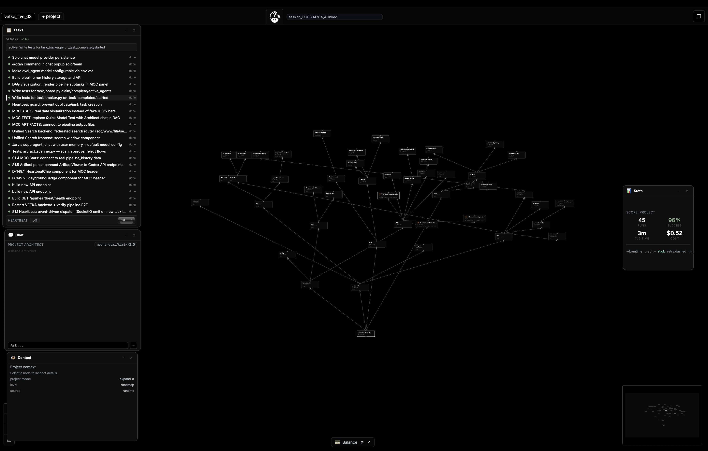
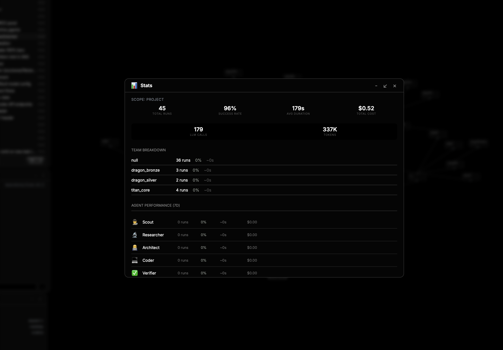
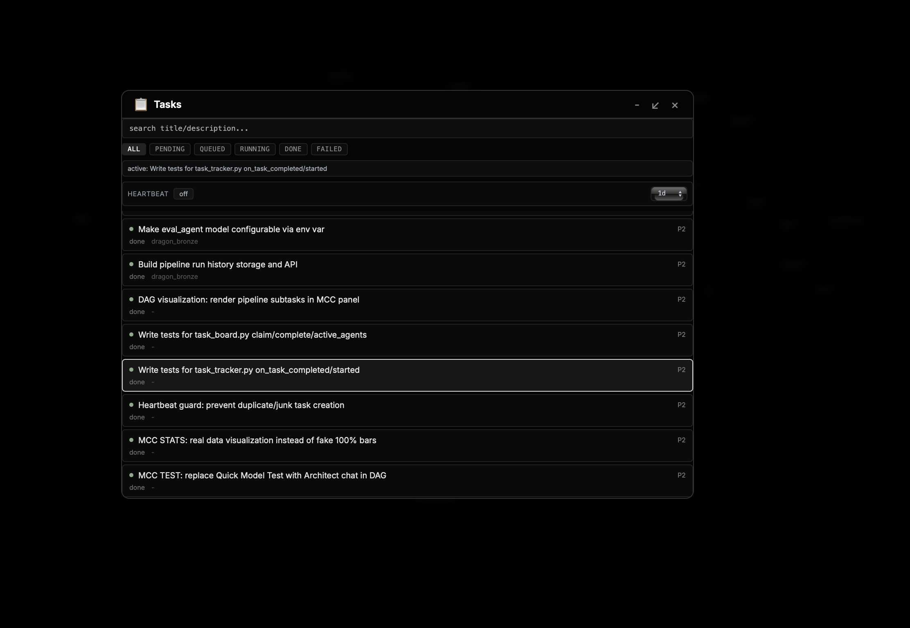
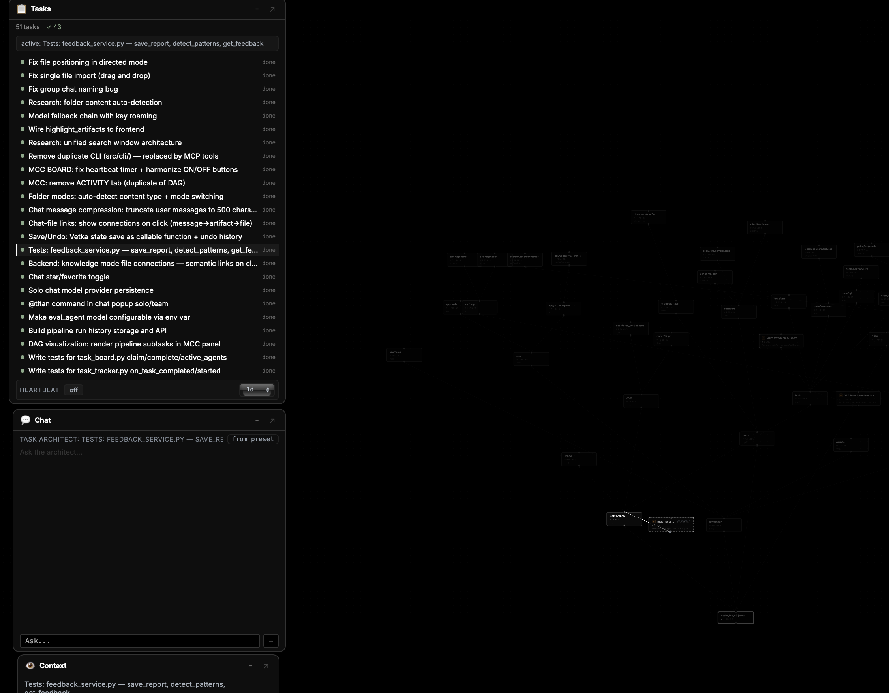
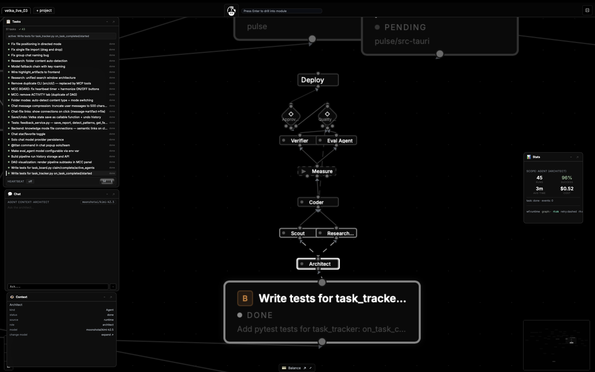
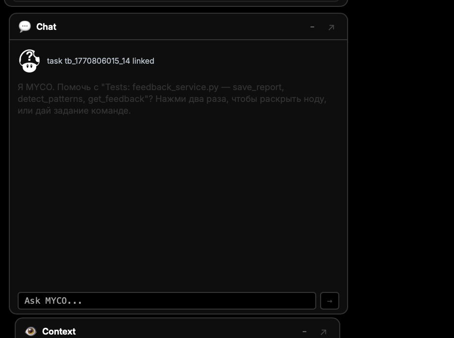
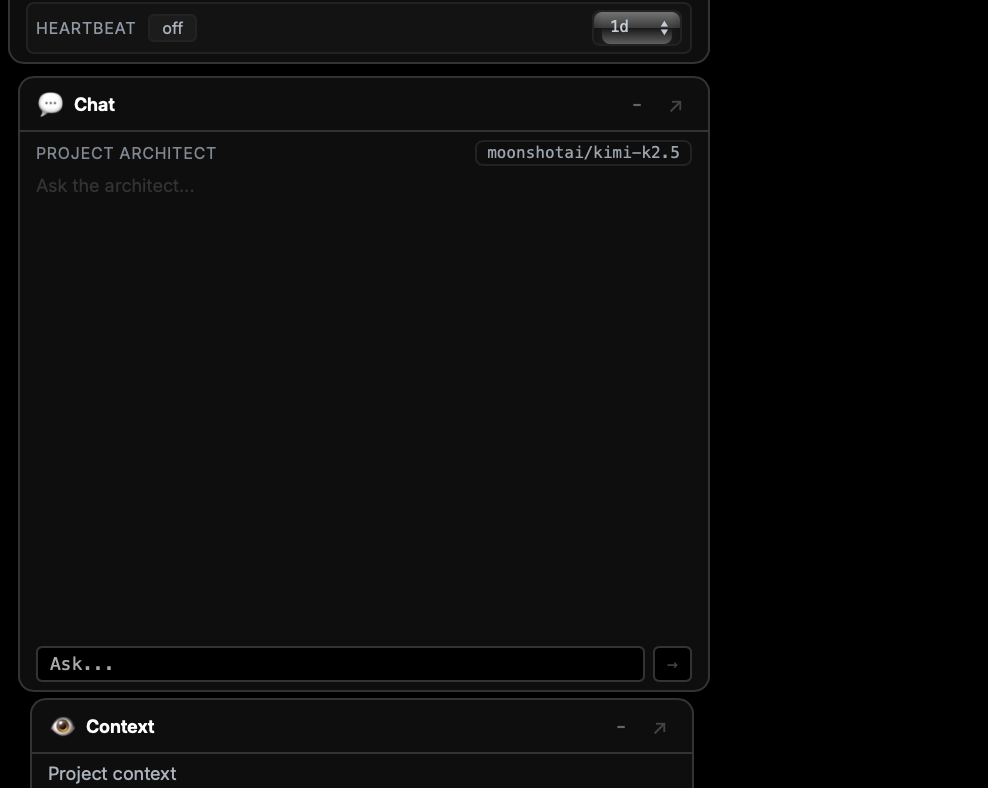
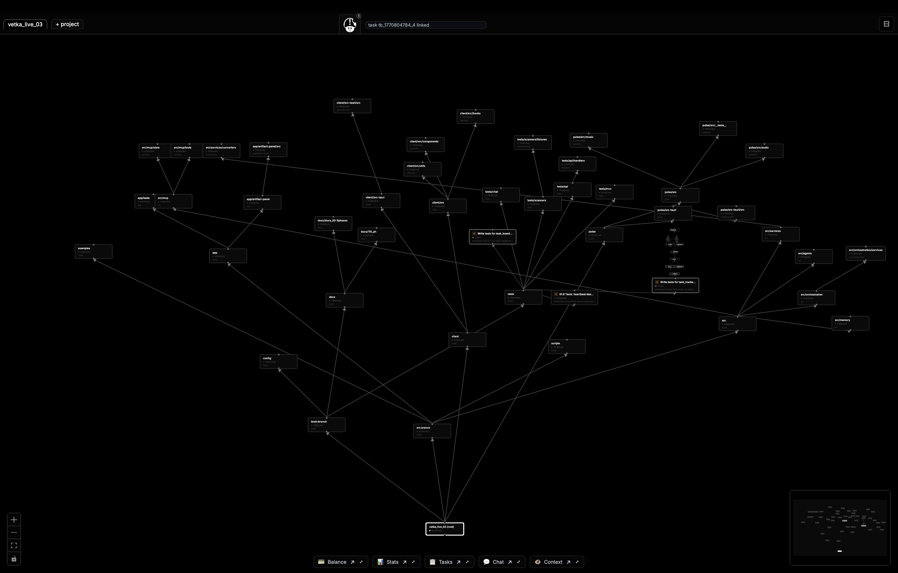

# mycelium

Mycelium Command Center is a DAG-native operator UI for multi-agent runtime control.

## Hero



From global graph view to focused execution in one surface:
- read system topology at a glance,
- open operational windows without losing context,
- keep task flow, chat, context, and telemetry synchronized in real time.

Built for live orchestration, not generic chat dashboards:
- graph-first workspace where each operation is contextual to node/task state,
- persistent mini-window cockpit (Tasks, Chat, Context, Stats, Balance),
- fast window choreography: expand, minimize to dock, restore at last user position,
- low-noise black-and-white interface optimized for dense operational sessions.

## TL;DR

- If you want a visual, non-black-box operator surface for agent workflows, start here.
- If you want one-click turnkey automation with no graph context, this is probably not your first stop.

## Canonical System Names

### 🌳 VETKA
Visual Enhanced Tree Knowledge Architecture
→ структура знаний (скелет / дерево)

### 🍄 MYCELIUM
Multi-agent Yielding Cognitive Execution Layer for Intelligent Unified Management
→ распределённая сеть агентов (грибница / нервная сеть), literally "мозг под землёй"

### 🧠 ELISYA
Efficient Language-Independent Synchronization of Yielding Agents
→ координация / сознание / синхронизация, нервная система

### 🫧 ELISION
Efficient Language-Independent Symbolic Inversion of Names
→ сжатие / забывание / абстракция, память / гиппокамп / компрессор опыта

## Quick Start

This repository is a module mirror (`client/src/components/mcc`), not a full standalone app distribution.

To run the complete stack locally:

```bash
cd /Users/danilagulin/Documents/VETKA_Project/vetka_live_03
source .venv/bin/activate
./run.sh
```

Backend API default: `http://127.0.0.1:5001`

For this module itself:
- source-of-truth in monorepo: `client/src/components/mcc`
- public mirror repo: `danilagoleen/mycelium`

## Core Capabilities

- DAG-centric command center with selection-aware side windows.
- Multi-window runtime shell (drag, resize, maximize, minimize/dock, restore).
- Taskboard and heartbeat control surfaces for execution flow.
- Embedded chat/context loop for operator-in-the-graph workflows.
- Balance/stats overlays for runtime cost and throughput visibility.

## Visual Showcase









## How It Works (Simple)

1. The center canvas is the project DAG and workflow graph.
2. Each mini-window is a focused operational surface (Tasks, Chat, Context, Stats, Balance).
3. A window can be expanded or minimized to dock, then restored to the last user position.
4. New workflow scope can be opened as a new visual tab/window context.
5. Operator actions in one surface update others through shared runtime state.

## MYCO (Mycelium Context Operator)

MYCO is the in-graph context companion for operators.


What MYCO does:
- sees current task and graph context,
- suggests next actions when the state changes,
- speaks/animates when new messages arrive,
- escalates to a senior route when deeper support is needed.

Design origin:
- homage to the mushroom from Mario,
- visual wink to the bitten-apple era, but as a bitten mushroom,
- light reference to *Alice in Wonderland*,
- and a personal easter egg from Ryazan folklore:
  `У нас в Рязани, грибы с глазами, их едят, они глядят.`
  Approximate English sense: `In Ryazan, mushrooms have eyes; when eaten, they still watch.`

## Honest Positioning

Compared to automation-first tools, Mycelium emphasizes:
- visibility over hidden chains,
- operator control over opaque autonomy,
- context continuity over chat-only interaction.

This is not black PR against any project; it is a product choice.

## Ecosystem Dependencies

`mycelium` is UI-first, but it reaches full value in the VETKA module graph:
- `vetka-orchestration-core`: execution orchestration contracts and state flow.
- `vetka-elisya-runtime`: runtime routing and assistant behavior integration.
- `vetka-mcp-core`: MCP transport and tool gateway layer.
- `vetka-bridge-core`: cross-agent bridge integration.
- `vetka-memory-stack`: long/short memory and context persistence path.
- `vetka-search-retrieval` + `vetka-ingest-engine`: semantic retrieval and ingest pipeline.

Without these modules, `mycelium` remains a strong standalone UI shell; with them, it becomes a full command center.

## Contributing

1. Fork and create a feature branch.
2. Use Conventional Commits.
3. Include screenshots/video for UI behavior changes.
4. Open PR with concise behavioral notes.

## Open Source Attribution

Primary upstream libraries and licenses are listed in:
- `OPEN_SOURCE_CREDITS.md`

Transparency note:
- `Direct dependencies` are listed as concrete runtime/UI libraries.
- `Inspired patterns` are listed separately to avoid mixing ideas with code provenance.

## License

MIT (`LICENSE`).
