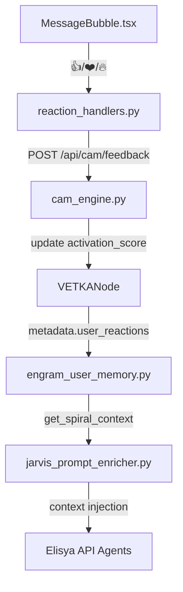

# **Отчёт по интеграции Surprise Metrics в CAM/Engram**
**Дата:** 2026-02-07
**Фаза:** 118 (Post-108.7)
**Цель:** Реализация метрик удивления (surprise metrics) для фаворитов чатов/файлов и реакций на сообщения, с передачей контекста в API-агентов через Elisya и обучением локальных моделей.
---

## **1. Архитектурный обзор**

### **1.1. Компоненты системы**
| Компонент                     | Файл/Модуль                                      | Ответственность                                                                 |
|-------------------------------|--------------------------------------------------|---------------------------------------------------------------------------------|
| **CAM Engine**                | `src/orchestration/cam_engine.py`                | Расчёт `activation_score`, хранение реакций в metadata узлов.                   |
| **Engram User Memory**        | `src/memory/engram_user_memory.py`              | Хранение пользовательских предпочтений, включая реакции на чаты/файлы.          |
| **EvalAgent**                  | `src/agents/eval_agent.py`                       | Оценка качества ответов (scoring), интеграция с реакциями пользователей.        |
| **Reactions UI**               | `client/src/components/chat/MessageBubble.tsx`  | Интерфейс реакций (👍/❤️/🔥), отправка событий через Socket.IO.                     |
| **API Агентов (Elisya)**       | `src/orchestration/orchestrator_with_elisya.py` | Передача контекста реакций в вызовы LLM-агентов.                                |
| **Jarvis Super-Agent**         | `src/agents/jarvis_prompt_enricher.py`           | Обучение на основе реакций, генерация подсказок с учётом предпочтений.         |

---

## **2. Точки интеграции Surprise Metrics**

### **2.1. Маркеры в коде (Critical Path)**
| **Маркер**                     | **Файл**                                      | **Строка** | **Описание**                                                                                     |
|---------------------------------|-----------------------------------------------|------------|-------------------------------------------------------------------------------------------------|
| `TODO_CAM_EMOJI`                | `MessageBubble.tsx`                            | 287-289    | Связь эмодзи-реакций с CAM (весовые коэффициенты для `activation_score`).                        |
| `TODO_CAM_INDICATOR`            | `ChatSidebar.tsx`                              | 32         | Индикаторы активации чатов в боковой панели.                                                     |
| `TODO_CAM_PIN`                   | `FileCard.tsx`                                 | 548, 602   | Привязка фаворитов файлов к CAM (вес для pinned узлов).                                          |
| `TODO_CAM_UI`                   | `UnifiedSearchBar.tsx`                         | 1006       | Интеграция CAM-фильтров в поиск (hot/warm/cold).                                                 |
| `MARKER_108_7_ENGRAM_ELISION`    | `engram_user_memory.py`                        | 449-452    | Спиральный контекст для Engram (включение реакций в `get_spiral_context`).                      |
| `FIX_104.7`                     | `engram_user_memory.py`                        | 549-556    | Исправление удаления пользовательских данных (включая реакции).                               |

---

### **2.2. Ключевые зависимости**
| **Зависимость**                | **Источник**                                  | **Цель**                                                                                     |
|---------------------------------|-----------------------------------------------|---------------------------------------------------------------------------------------------|
| `activation_score`              | `cam_engine.py:59-64`                          | Расчёт релевантности узлов (включая реакции).                                                 |
| `user_reactions`                | `cam_engine.py:205-210`                       | Хранение реакций в metadata узлов CAM.                                                        |
| `get_spiral_context`            | `engram_user_memory.py:452-502`               | Формирование контекста для Jarvis (включает реакции).                                        |
| `eval_score`                     | `eval_agent.py:119-125`                        | Оценка качества ответов (интеграция с реакциями).                                            |
| `socket.io:message_reaction`    | `reaction_handlers.py:23-141`                 | Обработка реакций в реальном времени.                                                        |

---

## **3. Предлагаемые изменения**

### **3.1. CAM Engine (`cam_engine.py`)**
- **Добавление весов для эмодзи-реакций** (стр. 184-189):
  ```python
  emoji_weights = {
      '👍': 0.2,  # Like
      '❤️': 0.3,  # Love
      '🔥': 0.25, # Insightful
      '💡': 0.15, # Helpful
      '❌': -0.1  # Not relevant
  }
  ```
- **Обновление `activation_score`** (стр. 193-196):
  ```python
  new_score = min(1.0, max(0.0, old_score + adjustment))
  ```

### **3.2. Engram User Memory (`engram_user_memory.py`)**
- **Расширение `get_spiral_context`** (стр. 452-502):
  ```python
  # Добавление реакций в спиральный контекст
  if 'user_reactions' in node.metadata:
      context['prefs']['reactions'] = node.metadata['user_reactions'][-5:]  # Последние 5 реакций
  ```

### **3.3. Reactions UI (`MessageBubble.tsx`)**
- **Реализация `TODO_CAM_EMOJI`** (стр. 287-289):
  ```typescript
  const handleReaction = (emoji: string) => {
      fetch('/api/cam/feedback', {
          method: 'POST',
          body: JSON.stringify({
              node_id: messageId,
              reaction_type: emoji,
              weight_adjustment: emoji_weights[emoji]
          })
      });
  };
  ```

### **3.4. API Агентов (`orchestrator_with_elisya.py`)**
- **Передача контекста реакций** (стр. 2636):
  ```python
  # Добавление реакций в контекст вызова агента
  if 'user_reactions' in context:
      prompt += f"\nUser reactions to similar content: {context['user_reactions']}"
  ```

---

## **4. Связи между компонентами**


---

## **5. Рекомендации по реализации**

### **5.1. Приоритеты**
1. **Critical Path (MVP):**
   - Реализовать `TODO_CAM_EMOJI` в `MessageBubble.tsx`.
   - Добавить обработку реакций в `cam_engine.py` (обновление `activation_score`).
   - Интегрировать реакции в `get_spiral_context` (`engram_user_memory.py`).

2. **Medium Priority:**
   - Реализовать индикаторы активации в `ChatSidebar.tsx` (`TODO_CAM_INDICATOR`).
   - Добавить фильтрацию по `hot/warm/cold` в `UnifiedSearchBar.tsx` (`TODO_CAM_UI`).

3. **Low Priority:**
   - Оптимизация весов реакций (A/B тестирование коэффициентов).
   - Визуализация метрик удивления в 3D-viewport.

### **5.2. Тестирование**
- **Unit-тесты:**
  - Проверка обновления `activation_score` в `cam_engine.py`.
  - Тестирование включения реакций в `get_spiral_context`.
- **Интеграционные тесты:**
  - Проверить цепочку: реакция в UI → обновление CAM → включение в Engram.
- **E2E-тесты:**
  - Симуляция пользовательских реакций и проверка влияния на ответы агентов.

---

## **6. Риски и митигации**
| **Риск**                          | **Митигация**                                                                                     |
|-----------------------------------|-------------------------------------------------------------------------------------------------|
| Зацикливание на негативных реакциях | Ограничить вес отрицательных реакций (`❌`: max -0.1).                                         |
| Перегрузка контекста в Engram     | Лимитировать количество реакций в `get_spiral_context` (последние 5).                         |
| Несовместимость с существующими данными | Миграционный скрипт для добавления `user_reactions` в metadata узлов CAM.                     |
| Производительность при большом количестве реакций | Кеширование `activation_score` в Redis (инвалидация при новых реакциях).                     |

---

## **7. Следующие шаги**
1. **Имплементация Critical Path** (2-3 дня):
   - Реализовать маркеры `TODO_CAM_EMOJI`, `MARKER_108_7_ENGRAM_ELISION`.
   - Протестировать цепочку реакций → CAM → Engram.
2. **Интеграция с API агентами** (1-2 дня):
   - Добавить контекст реакций в вызовы через Elisya.
3. **Оптимизация и тестирование** (2 дня):
   - A/B тестирование весов реакций.
   - Нагрузочное тестирование с 1000+ реакций.

---

**Отчёт подготовлен:** 2026-02-07
**Автор:** VETKA MCP Agent (Phase 118)
**Статус:** Готово к имплементации.