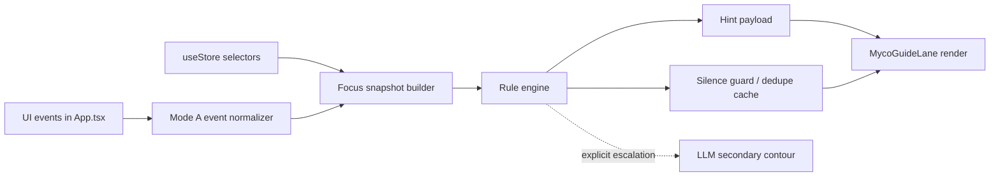

MARKER_163A.MYCO.MODE_A.ARCHITECTURE.V1
LAYER: L3
DOMAIN: UI|CHAT|TOOLS
STATUS: PLANNED
SOURCE_OF_TRUTH: docs/163_ph_myco_VETKA_help/PHASE_163A_MYCO_MODE_A_ARCHITECTURE_PROPOSAL_2026-03-08.md
LAST_VERIFIED: 2026-03-08

# PHASE_163A_MYCO_MODE_A_ARCHITECTURE_PROPOSAL_2026-03-08

## Synopsis
Architecture proposal for `MYCO Mode A`: deterministic guide layer inside VETKA main surface. No LLM in the primary feedback loop. The system reacts to UI events and state changes and emits short hint payloads with strict dedupe and silence rules.

## Table of Contents
1. Architectural placement
2. Data flow
3. Core contracts
4. Next-best-action rules
5. Silence and escalation policy
6. Cross-links
7. Status matrix

## Treatment
This is an implementation-facing proposal. It is intentionally narrow: reuse existing VETKA state and events instead of creating another assistant stack.

## Short Narrative
Mode A should live next to `App.tsx`, not behind `/api/chat/quick`. It listens to existing app events, reads stable store state, derives a canonical focus snapshot, matches deterministic rules, and renders one hint lane when the user is not typing. LLM remains an optional second contour only when Mode A explicitly escalates.

## Full Spec
### Architectural placement
#### Frontend-only primary loop
- Host component:
  - proposed: `client/src/components/myco/MycoGuideLane.tsx`
- App integration point:
  - proposed mount near existing global surfaces in `client/src/App.tsx` after `UnifiedSearchBar` and before modal overlays.
- State source:
  - `client/src/store/useStore.ts`
  - local `App.tsx` surface state: `isChatOpen`, `isArtifactOpen`, `leftPanel`, `treeViewMode`, `selectedNode`
- Event source:
  - `window.dispatchEvent`/`window.addEventListener` patterns already used in `client/src/App.tsx`
  - socket-to-ui events already bridged in `client/src/hooks/useSocket.ts`

#### Optional secondary contour
- Only when a rule explicitly calls for richer help:
  - user clicks "Explain more"
  - user opens a dormant/unimplemented mode
  - user asks in voice/text for deeper help
- Secondary path may call `/api/chat/quick` or voice help path, but it must not own the default hint lane.

### Data flow

### Core contracts
#### `TAG:MYCO.MODE_A.FOCUS_SNAPSHOT`
Canonical derived object:
- `surface`
  - one of `tree`, `chat`, `chat_history`, `model_directory`, `artifact`, `search`, `scanner`, `devpanel`, `web_window`, `context_menu`, `modal`
- `selection`
  - `nodeId`, `nodeType`, `path`, `isPinned`, `isFavorite`
- `search`
  - `context`, `mode`, `queryEmpty`
- `chat`
  - `isOpen`, `leftPanel`, `currentChatId`
- `artifact`
  - `isOpen`, `filePath`, `inVetka`
- `interaction`
  - `lastEvent`, `lastHotkey`, `lastTransitionAt`
- `capabilities`
  - computed list like `open_chat`, `open_artifact`, `pin_file`, `switch_search_context`, `index_file`, `favorite_item`

#### `TAG:MYCO.MODE_A.HINT_PAYLOAD`
Strict payload fields:
- `id`
- `surface`
- `priority`
- `why_this_surface`
- `available_actions`
- `next_best_actions`
- `shortcut_hints`
- `mute_until_state_key`
- `escalation_allowed`

#### `TAG:MYCO.MODE_A.STATE_KEY`
Dedupe key formula:
- `surface`
- selected node id/path
- chat open state
- artifact open state
- left panel mode
- search context/mode/query-empty
- last event family

Example:
- `tree|node:abc123|chat:0|artifact:0|left:none|search:vetka/hybrid/empty|event:select_node`

### Event intake
#### Existing event anchors to normalize
- `vetka-tree-refresh-needed`: `client/src/App.tsx:444`; `client/src/App.tsx:568`; `client/src/App.tsx:760`
- `vetka-switch-to-scanner`: `client/src/App.tsx:445`; `client/src/App.tsx:754`
- `vetka-chat-drop`: `client/src/App.tsx:777`
- `vetka-toggle-chat-panel`: `client/src/App.tsx:790`
- `vetka-open-artifact-file`: `client/src/App.tsx:850`
- `vetka-open-artifact`: `client/src/App.tsx:851`
- `vetka-save-file`: `client/src/App.tsx:877`
- `vetka-undo`: `client/src/App.tsx:885`
- tree mode/context menu hooks: `client/src/App.tsx:905`; `client/src/App.tsx:920`

#### Proposed normalized MYCO events
- `vetka-myco-surface-changed`
- `vetka-myco-focus-changed`
- `vetka-myco-hint-dismissed`
- `vetka-myco-escalate`

### Next-best-action rules
Rule families:
1. Surface-introduction rules
2. Selection-advance rules
3. Recovery rules
4. Shortcut rules
5. Silence rules

Examples:
- If `surface=tree` and `selectedNode` exists:
  - next actions: open chat, pin file, open artifact
- If `surface=search` and `queryEmpty=true`:
  - next actions: choose `vetka/web/file`, then type query
- If `surface=artifact` and file is outside VETKA:
  - next actions: add to VETKA, favorite, open related chat
- If `surface=chat` and `leftPanel=models`:
  - next actions: choose model, verify provider/key, return to chat

### Silence and escalation policy
Mode A must stay silent when:
- user is actively typing in search or chat input
- state key has not changed
- last hint was dismissed for same key
- surface transition is internal/no-op

Mode A may escalate when:
- user clicks disabled `cloud/` or `social/`
- file is external and ingest requires explanation
- user opens voice help explicitly

## Cross-links
See also:
- [PHASE_163A_MYCO_MODE_A_RECON_REPORT_2026-03-08](./PHASE_163A_MYCO_MODE_A_RECON_REPORT_2026-03-08.md)
- [PHASE_163A_MYCO_MODE_A_SCENARIO_MATRIX_2026-03-08](./PHASE_163A_MYCO_MODE_A_SCENARIO_MATRIX_2026-03-08.md)
- [PHASE_163A_MYCO_MODE_A_NARROW_MVP_CUT_2026-03-08](./PHASE_163A_MYCO_MODE_A_NARROW_MVP_CUT_2026-03-08.md)
- [PHASE_163A_MYCO_MODE_A_TEST_STRATEGY_2026-03-08](./PHASE_163A_MYCO_MODE_A_TEST_STRATEGY_2026-03-08.md)
- [PHASE_163A_MYCO_MODE_A_IMPLEMENTATION_PLAN_2026-03-08](./PHASE_163A_MYCO_MODE_A_IMPLEMENTATION_PLAN_2026-03-08.md)
- [MYCO_VETKA_CONTEXT_MEMORY_STACK_V1](./MYCO_VETKA_CONTEXT_MEMORY_STACK_V1.md)

## Status matrix
| Layer | Status | Evidence |
|---|---|---|
| Event inputs | Implemented in project | `client/src/App.tsx:444`; `client/src/hooks/useSocket.ts:499` |
| Canonical focus snapshot | Planned | no shared selector object exists |
| Rule engine | Planned | no VETKA-main MYCO reducer exists |
| Hint lane | Planned | no MYCO component mounted in `client/src/App.tsx` |
