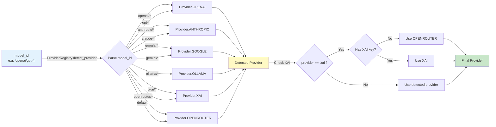
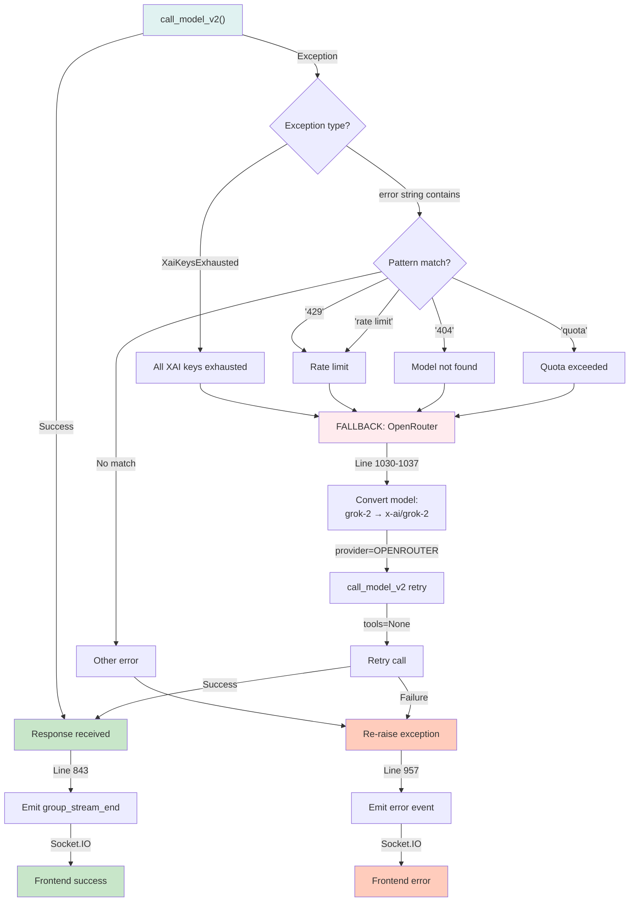
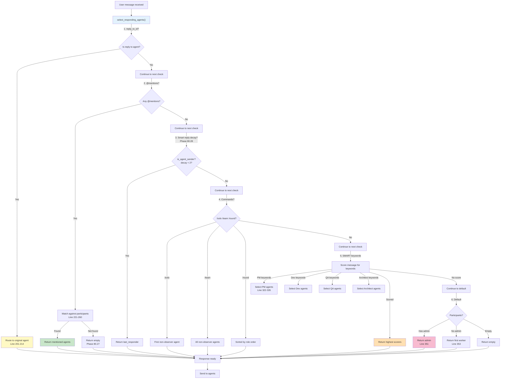
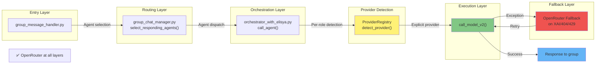
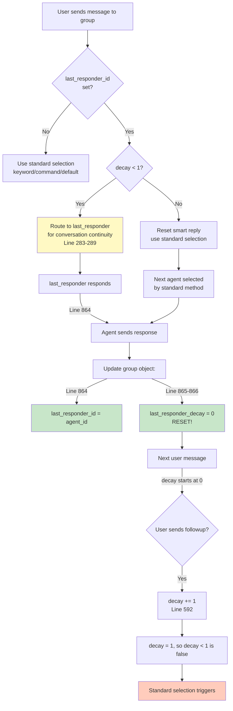

# Group Chat Flow Diagram

## Complete Message Flow with OpenRouter Integration

```mermaid
graph TD
    A["Socket.IO: group_message"] -->|Line 529| B["Parse Message"]
    B -->|541-550| C["Extract: group_id, sender_id, content, @mentions"]

    C -->|600-614| D{"Check @mentions"}
    D -->|MCP agents| E["notify_mcp_agents()"]
    E -->|emit mcp_mention| F["Browser/Claude Code extensions"]
    D -->|Group agents| G["Continue routing"]

    G -->|Line 665| H["select_responding_agents()"]

    H -->|Line 201-214| I{"Reply routing?"}
    I -->|Yes| J["Route to original agent"]
    I -->|No| K{"@mentions?"}

    K -->|Yes| L["Select mentioned agents"]
    K -->|No| M{"Smart reply decay?"}

    M -->|Yes, decay < 1| N["Use last_responder"]
    M -->|No| O["SMART keyword selection"]

    O -->|PM keywords| P["Select PM"]
    O -->|Dev keywords| Q["Select Dev"]
    O -->|QA keywords| R["Select QA"]
    O -->|Architect keywords| S["Select Architect"]

    J --> T["Get participant data"]
    L --> T
    N --> T
    P --> T
    Q --> T
    R --> T
    S --> T

    T -->|Line 716-717| U["Extract model_id, role"]
    U -->|Line 721-737| V["Map Role → AgentType"]

    V -->|MARKER_94.6| W["PM→'PM', Dev→'Dev'<br/>QA→'QA', Architect→'Architect'"]

    W -->|Line 800-810| X["call_agent()"]
    X -->|agent_type, model_id, prompt| Y["orchestrator.call_agent()"]

    Y -->|Line 2242-2331| Z["Validate agent_type"]
    Z -->|Line 2300-2305| AA["Check manual model override"]

    AA -->|Override exists| AB["Set model_routing manual"]
    AA -->|No override| AC["Use auto routing"]

    AB --> AD["_run_agent_with_elisya_async()"]
    AC --> AD

    AD -->|Line 1215| AE["Reframe context with Elisya"]
    AE -->|Line 1235-1257| AF{"Manual override?"}

    AF -->|Yes| AG["ProviderRegistry.detect_provider()"]
    AF -->|No| AH["_get_routing_for_task()"]

    AG -->|Line 1244| AI["Detect provider from model_id"]
    AH --> AJ["Get auto routing"]

    AI -->|Check result| AK{"Provider is XAI?"}
    AK -->|Yes| AL["Check APIKeyService.get_key('xai')"]
    AK -->|No| AM["Use detected provider"]

    AL -->|Key exists| AN["Use XAI provider"]
    AL -->|Key missing| AO["Fallback to OpenRouter"]

    AN --> AP["Inject API key to environment"]
    AJ --> AP
    AM --> AP
    AO --> AP

    AP -->|Line 1023| AQ["call_model_v2()"]
    AQ -->|model, provider, tools| AR["LLM Call"]

    AR -->|Success| AS["Response received"]
    AR -->|XaiKeysExhausted| AT["Catch exception"]
    AR -->|404/429/quota| AU["Catch exception"]

    AT -->|Line 1026-1037| AV["Retry with OpenRouter"]
    AU -->|Line 1038-1050| AW["Retry with OpenRouter"]

    AV -->|Convert model| AX["'grok-2' → 'x-ai/grok-2'"]
    AW --> AX

    AX -->|provider=OPENROUTER| AY["call_model_v2 retry"]
    AY -->|tools=None| AZ["LLM Call (fallback)"]

    AZ -->|Response received| AS

    AS -->|Line 833| BA["Store in group_chat_manager"]
    BA -->|Line 842-860| BB["Emit group_stream_end"]
    BB -->|Socket.IO| BC["Frontend receives response"]

    style A fill:#e1f5ff
    style X fill:#fff3e0
    style AD fill:#f3e5f5
    style AQ fill:#e8f5e9
    style AV fill:#fce4ec
    style BC fill:#e1f5ff
```



---

## Provider Detection Logic



---

## Fallback Trigger Tree



---

## Parallel Dev+QA Execution

```mermaid
graph TD
    A["participants_to_respond<br/>includes Dev, QA"] -->|Line 700| B["While loop: max 10 agents"]

    B -->|First iteration| C["Dev is first in queue"]
    C -->|Line 800-810| D["call_agent(Dev, ...)"]
    D -->|await _run_agent_with_elisya_async| E["Dev execution"]
    E -->|Provider detection| F["Get Dev's provider"]
    F -->|call_model_v2| G["Dev LLM call"]

    G -->|Check response| H["Parse Dev output"]
    H -->|Line 829| I["Store in previous_outputs"]
    I -->|Line 899-954| J{"Check @mentions in Dev response"}

    J -->|@QA mentioned| K["Add QA to queue<br/>Line 951"]
    J -->|No mentions| L["Continue with next agent"]

    B -->|Second iteration| M["Process next agent"]
    M -->|Could be QA from mention| N{"QA in queue?"}

    N -->|Yes| O["call_agent(QA, ...)"]
    N -->|No| P["End of queue"]

    O -->|await _run_agent_with_elisya_async| Q["QA execution"]

    Q -->|Parallel: Both run if<br/>both in queue| R["Can overlap with Dev<br/>if managed correctly"]

    G -->|Completes| H2["Dev done"]
    Q -->|Completes| I2["QA done"]

    H2 --> S["Dev output in previous_outputs"]
    I2 --> T["QA output in previous_outputs"]

    S --> U["Chain context for next agent<br/>Line 775-779"]
    T --> U

    U --> V["Response sent to group<br/>Line 842-860"]

    style A fill:#e1f5fe
    style K fill:#fff9c4
    style R fill:#ffe0b2
    style V fill:#c8e6c9
```

---

## Role Selection Priority



---

## OpenRouter Integration Points



---

## Phase 80.28: Smart Reply Decay


